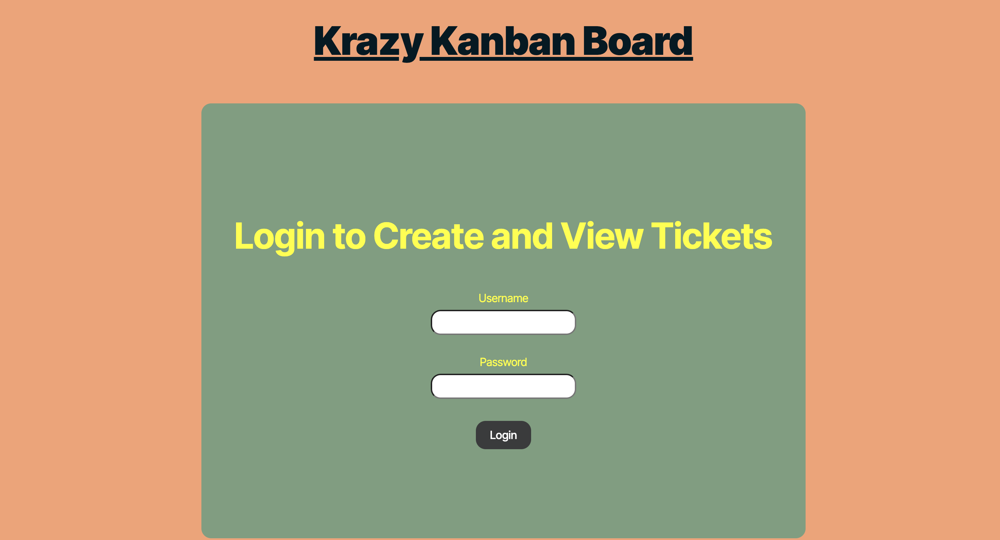

# Mod 14 Kanban Board

## Description

This is a Kanban board application that allows users to view and manage their tasks. The application utilizes Node.js, Express.js, Sequelize, and PostgreSQL. 

### Criteria

- GIVEN a Kanban board with a secure login page
- WHEN I load the login page
THEN I am presented with form inputs for username and password
- WHEN I enter my valid username and password
THEN I am authenticated using JSON Web Tokens (JWT) and redirected to the main Kanban board page
- WHEN I enter an invalid username or password
THEN I am presented with an error message indicating that the credentials are incorrect
- WHEN I successfully log in
THEN a JWT is stored securely in the client's local storage for subsequent authenticated requests
- WHEN I log out
THEN the JWT is removed from the client's local storage and I am redirected to the login page
- WHEN I try to access the Kanban board page without being authenticated
THEN I am redirected to the login page
- WHEN I remain inactive for a defined period
THEN my session expires, the JWT is invalidated, and I am redirected to the login page upon my next action
-Repository contains quality README file with description, screenshot, and link to deployed application.

- Bonus: 
Application contains functionality to sort Kanban tickets, 
Application contains functionality to filter Kanban tickets

## Table of Contents

- [Installation](#installation)
- [Usage](#usage)
- [License](#license)
- [Contributors](#contributors)
- [Tests](#tests)
- [Questions](#questions)

## Installation
To install necessary dependencies, run the following command:

```bash
npm install 
```

## Usage
To use the Kanban board application, run the following command:

```bash
npm start
```

## License
None

## Contributors
Melina Nevarez

## Tests
No test currently available.  Placeholder included for future use if needed.

## Questions

GitHub: [https://github.com/melinanev/14-kanban](https://github.com/melinanev/14-kanban)

Email: melina.l.nevarez@gmail.com

GitHub: [https://github.com/melinanev](https://github.com/melinanev)
# MelNev-KrazyKanban
